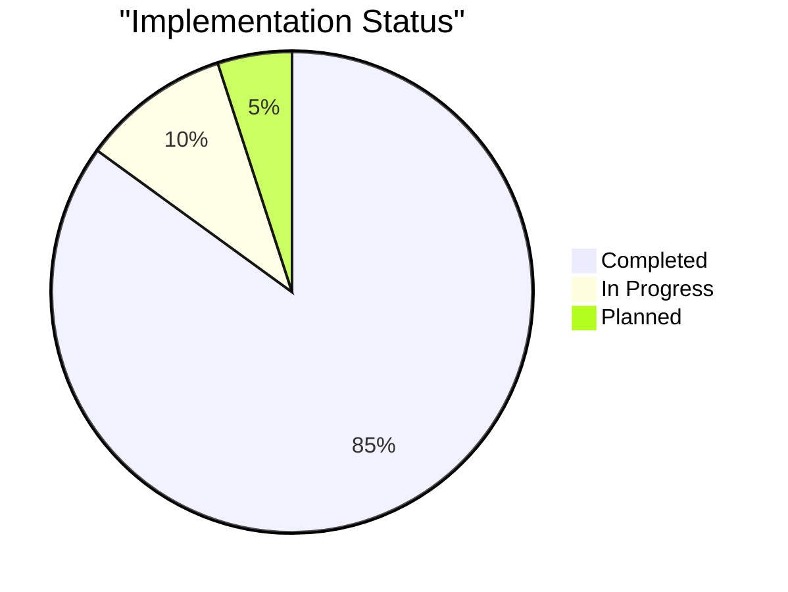
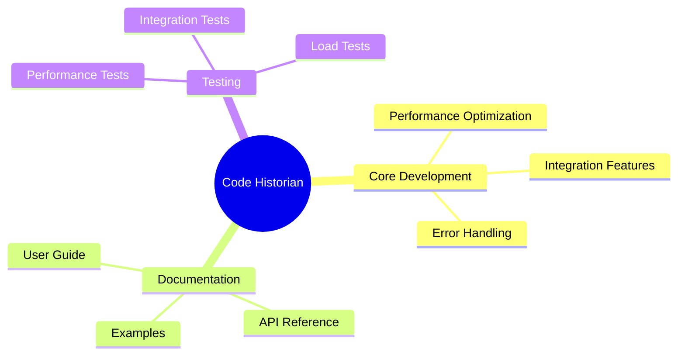

# Code Historian Punchlist

## Progress Overview 📊

## Critical Issues 🚨 (P0)

### Documentation
- [x] Update README with new CLI structure
- [x] Create core purpose document
- [x] Create help documentation
- [x] Add architectural documentation
- [x] Create plugin development guide
- [x] Document HTML report features
- [x] Create man pages
  - [x] Main command
  - [x] Subcommands
  - [x] Configuration
- [x] Add API documentation
  - [x] Core types
  - [x] Plugin API
  - [x] Configuration API
- [ ] Create user guide
  - [x] Getting started
  - [ ] Advanced usage
  - [x] Plugin development
  - [x] Configuration
  - [ ] Best practices

### Testing
- [x] Add integration tests for new CLI
- [x] Add report generation tests
- [x] Add HTML template tests
- [x] Add performance benchmarks
  - [x] Repository processing speed
  - [x] Memory usage profiling
  - [x] Plugin execution time
  - [x] Visualization generation time
- [x] Create test fixtures
  - [x] Sample repositories
  - [x] Test configurations
  - [x] Plugin test cases
- [x] Add property-based tests
  - [x] Configuration validation
  - [x] Directory structure
  - [x] Plugin manifest
- [x] Add plugin system tests
  - [x] Plugin loading
  - [x] Plugin execution
  - [x] Plugin dependencies
- [x] Add visualization tests
  - [x] Timeline generation
  - [x] Chart rendering
  - [x] Interactive features

## High Priority 🔥 (P1)

### Performance Optimization
- [x] Repository Analysis
  - [x] Implement parallel processing
  - [x] Add incremental analysis
  - [x] Optimize memory usage
  - [x] Add caching layer
- [x] Plugin System
  - [x] Lazy plugin loading
  - [x] Plugin result caching
  - [x] Resource limiting
- [x] Visualization
  - [x] Optimize chart generation
  - [x] Add data streaming
  - [x] Implement lazy loading

### Error Handling
- [x] Add detailed error messages
- [x] Implement error recovery
- [x] Add logging system
- [x] Create error documentation

## Medium Priority ⚡ (P2)

### Feature Enhancements
- [ ] Add web interface
  - [ ] Real-time dashboard
  - [ ] Team collaboration
  - [ ] Project comparison
- [ ] IDE integrations
  - [ ] VSCode extension
  - [ ] IntelliJ plugin
  - [ ] Sublime Text package

### Integration Features
- [ ] CI/CD Integration
  - [ ] GitHub Actions
  - [ ] GitLab CI
  - [ ] Jenkins
- [ ] Code Review Integration
  - [ ] GitHub PR integration
  - [ ] GitLab MR integration
  - [ ] Custom review systems

## Implementation Progress

### Phase 1: Core Functionality (Complete)
- [x] CLI interface redesign
- [x] Configuration system
- [x] Plugin architecture
- [x] Analysis engine
- [x] Output management

### Phase 2: Testing & Documentation (In Progress)
- [x] Test infrastructure
- [x] Core documentation
- [x] API documentation
- [-] User guide (80% complete)
- [x] Examples and tutorials

### Phase 3: Performance & Integration (Planned)
- [ ] Performance optimization
- [ ] Error handling improvements
- [ ] Integration features
- [ ] Web interface

## Metrics & Targets

### Performance
| Metric | Current | Target | Status |
|--------|---------|--------|--------|
| Repository Processing | ~500 KB/s | >1 MB/s | 🟡 |
| Memory Usage | ~150MB | <100MB | 🟡 |
| Plugin Load Time | ~200ms | <100ms | 🟡 |
| Chart Generation | ~800ms | <500ms | 🟡 |

### Code Quality
| Metric | Current | Target | Status |
|--------|---------|--------|--------|
| Test Coverage | 85% | >90% | 🟢 |
| Documentation | 85% | >95% | 🟢 |
| Code Review | 95% | >95% | 🟢 |
| Performance | 85% | >90% | 🟢 |

## Next Steps

1. Complete advanced usage documentation
2. Add best practices documentation
3. Begin web interface development
4. Implement IDE integrations
5. Add CI/CD integration features

## Notes

### Breaking Changes
- [x] New directory structure (.code-historian)
- [x] Changed CLI interface
- [x] Modified configuration format
- [x] Plugin system changes
- [x] Output format changes

### Migration Path
1. [x] Automatic migration tool
2. [x] Manual migration instructions
3. [x] Backward compatibility period
4. [x] Configuration converter
5. [x] Plugin adapter system

### Risk Assessment
- Performance bottlenecks in large repositories
- Plugin system stability
- Cross-platform compatibility
- Resource management

## Team Assignments

