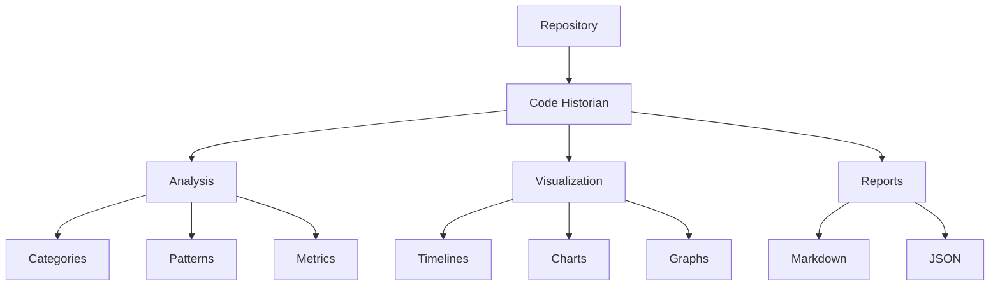

# Code Historian

A powerful tool for analyzing the evolution of code in software projects. Code Historian tracks changes in source files, categorizes them according to common software patterns, and generates detailed reports with visual timelines.



## Features

### Core Features ✨
- [x] **Smart Change Detection**: Automatically categorizes changes into 15 different categories
- [x] **Visual Timelines**: Generate visual representations of code evolution
- [x] **Detailed Statistics**: Track lines added, removed, and net changes
- [x] **Git Integration**: Deep integration with Git repositories
- [x] **Plugin System**: Extensible analysis capabilities
- [x] **ML-Based Categorization**: Optional machine learning for better categorization

### Analysis Categories 📊
- Architecture (structural changes)
- API (interface changes)
- Logic (flow modifications)
- Data (structure changes)
- Error Handling
- Logging
- Documentation
- Testing
- Performance
- Security
- Refactoring
- Dependencies
- Configuration
- UI/UX
- Accessibility

### Interaction Modes 🔄
- [x] **Command Line**: Traditional CLI interface
- [x] **Interactive Mode**: Guided configuration and analysis
- [x] **Watch Mode**: Real-time monitoring and analysis
- [x] **Configuration Files**: Persistent settings management

## Installation

### Using Cargo (Recommended)
```bash
cargo install code-historian
```

### From Source
```bash
git clone https://github.com/yourusername/code-historian.git
cd code-historian
cargo build --release
```

### Dependencies
- Rust 1.70+
- Git
- Graphviz (for visualizations)

## Usage

### Basic Usage
```bash
# Quick analysis
code-historian -r /path/to/repo

# Enable visualizations
code-historian -r /path/to/repo -v

# Interactive mode
code-historian -r /path/to/repo -i

# Watch mode
code-historian -r /path/to/repo -w
```

### Advanced Usage
```bash
# ML-based categorization
code-historian -r /path/to/repo --ml

# Custom plugins
code-historian -r /path/to/repo -p "security,performance"

# Custom history directory
code-historian -r /path/to/repo -H /path/to/history

# Pattern matching
code-historian -r /path/to/repo -p "*.rs,*.py" --recursive
```

### Configuration File
Create `~/.config/code-historian/config.toml`:
```toml
default_history_dir = ".history"
default_output_dir = "docs/history"
preferred_plugins = ["security", "performance"]
default_ml_enabled = true

[visualization]
theme = "modern"
timeline_style = "compact"
chart_style = "dark"
color_scheme = ["#4C9AFF", "#F66D44", "#6C8EBF"]
```

## Output

### Reports
- **Markdown**: Detailed change history with categorization
- **JSON**: Machine-readable analysis data
- **Visualizations**: Timelines, charts, and graphs

### Example Output Structure
```
output/
├── REPORT.md           # Main analysis report
├── timeline.png        # Visual timeline
├── categories.png      # Category distribution
├── impact.png         # Impact analysis
└── data.json          # Raw analysis data
```

## Development Status

### Implemented ✅
- Core analysis engine
- Git integration
- Basic ML categorization
- Plugin system
- Report generation
- Basic visualizations
- Interactive mode
- Watch mode
- Configuration system

### In Progress 🚧
- Enhanced ML capabilities
- Advanced visualization options
- Real-time analysis improvements
- Plugin marketplace

### Planned 📋
- Web interface
- IDE integrations
- Cloud deployment
- Team collaboration features

## Contributing

We welcome contributions! Please see [CONTRIBUTING.md](CONTRIBUTING.md) for guidelines.

### Development Setup
```bash
# Clone repository
git clone https://github.com/yourusername/code-historian.git
cd code-historian

# Install dependencies
cargo build

# Run tests
cargo test

# Run with debug output
RUST_LOG=debug cargo run -- -r /path/to/repo
```

## License

This project is licensed under the MIT License - see the [LICENSE](LICENSE) file for details.