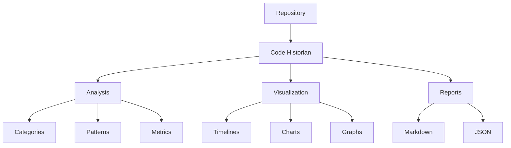

# Code Historian

A powerful tool for analyzing the evolution of code in software projects. Code Historian tracks changes in source files, categorizes them according to common software patterns, and generates detailed reports with visual timelines.



## Features

### Core Features ✨
- [x] **Smart Change Detection**: Automatically categorizes changes into 15 different categories
- [x] **Visual Timelines**: Generate visual representations of code evolution
- [x] **Detailed Statistics**: Track lines added, removed, and net changes
- [x] **Git Integration**: Deep integration with Git repositories
- [x] **Plugin System**: Extensible analysis capabilities
- [x] **ML-Based Categorization**: Optional machine learning for better categorization

### Analysis Categories 📊
- Architecture (structural changes)
- API (interface changes)
- Logic (flow modifications)
- Data (structure changes)
- Error Handling
- Logging
- Documentation
- Testing
- Performance
- Security
- Refactoring
- Dependencies
- Configuration
- UI/UX
- Accessibility

### Interaction Modes 🔄
- [x] **Command Line**: Traditional CLI interface
- [x] **Interactive Mode**: Guided configuration and analysis
- [x] **Watch Mode**: Real-time monitoring and analysis
- [x] **Configuration Files**: Persistent settings management

## Development Setup

### Prerequisites
- Rust 1.70+
- Git
- Graphviz (for visualizations)

### Building from Source
```bash
# Clone repository
git clone https://github.com/abcdqfr/code-historian.git
cd code-historian

# Install dependencies
cargo build

# Run tests
cargo test

# Run with debug output
RUST_LOG=debug cargo run -- -r /path/to/repo
```

## Usage

### Basic Usage
```bash
# Analyze a repository
code-historian -r /path/to/repo

# Interactive mode with guided setup
code-historian -r /path/to/repo -i

# Watch mode for real-time analysis
code-historian -r /path/to/repo -w

# Enable visualizations
code-historian -r /path/to/repo -v
```

### Advanced Usage
```bash
# Custom history directory
code-historian -r /path/to/repo -H /path/to/history

# Custom output directory
code-historian -r /path/to/repo -o /path/to/output

# Enable ML categorization
code-historian -r /path/to/repo --ml

# Watch mode with custom debounce time (in seconds)
code-historian -r /path/to/repo -w --debounce 5

# Use specific plugins
code-historian -r /path/to/repo -p "security,performance"

# Custom config file
code-historian -r /path/to/repo -C /path/to/config.toml

# Recursive analysis with file pattern
code-historian -r /path/to/repo --recursive -p "*.rs"
```

### Configuration File
Create `~/.config/code-historian/config.toml`:
```toml
default_history_dir = ".history"
default_output_dir = "docs/history"
preferred_plugins = ["security", "performance"]
default_ml_enabled = true

[visualization]
theme = "modern"
timeline_style = "compact"
chart_style = "dark"
color_scheme = ["#4C9AFF", "#F66D44", "#6C8EBF"]
```

## Output

### Reports
- **Markdown**: Detailed change history with categorization
- **JSON**: Machine-readable analysis data
- **Visualizations**: Timelines, charts, and graphs

### Example Output Structure
```
output/
├── REPORT.md           # Main analysis report
├── timeline.png        # Visual timeline
├── categories.png      # Category distribution
├── impact.png         # Impact analysis
└── data.json          # Raw analysis data
```

## Development Status

### Implemented ✅
- Core analysis engine
- Git integration
- Basic ML categorization
- Plugin system
- Report generation
- Basic visualizations
- Interactive mode
- Watch mode
- Configuration system

### In Progress 🚧
- Enhanced ML capabilities
- Advanced visualization options
- Real-time analysis improvements
- Plugin marketplace

### Planned 📋
- Web interface
- IDE integrations
- Cloud deployment
- Team collaboration features

## Contributing

We welcome contributions! Please see [CONTRIBUTING.md](CONTRIBUTING.md) for guidelines.

## License

This project is licensed under the MIT License - see the [LICENSE](LICENSE) file for details.