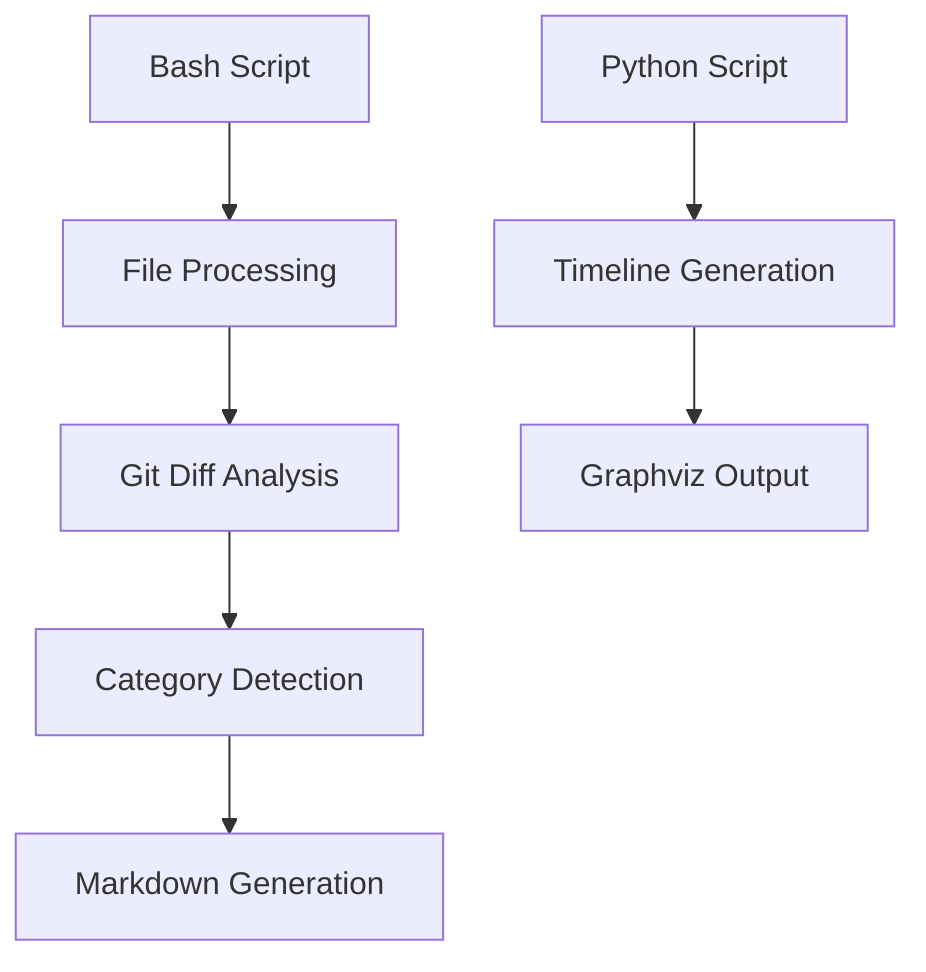
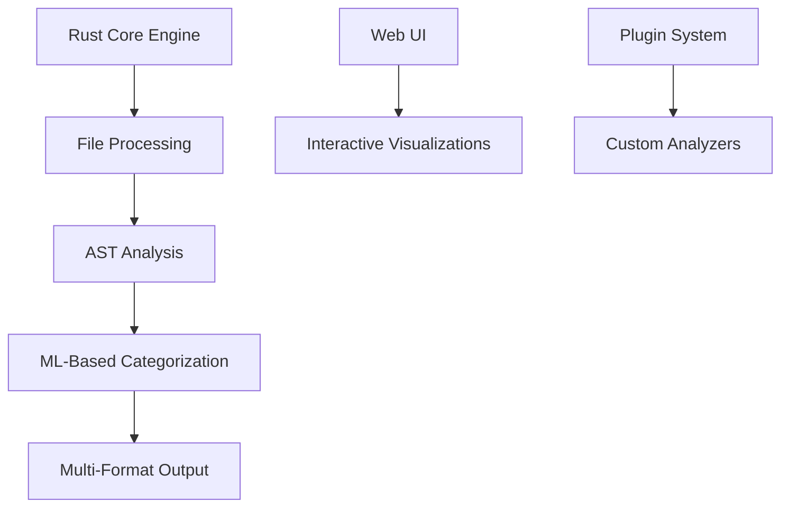
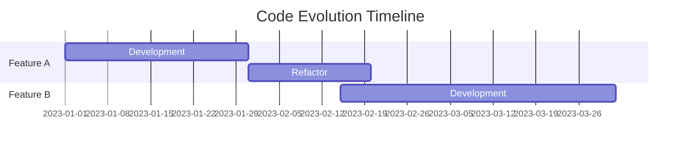
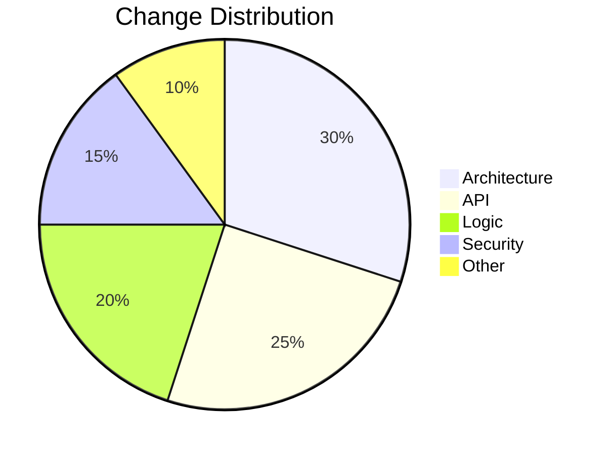
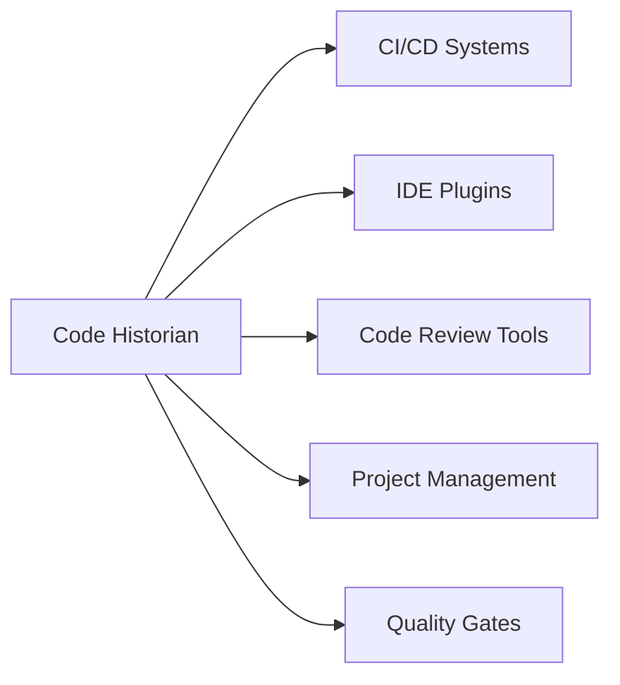

# Code Historian: Evolution & Modernization Proposal

## Executive Summary

Code Historian is a powerful tool for analyzing code evolution, but it can be significantly enhanced by modernizing its architecture and expanding its capabilities. This document outlines a comprehensive plan to evolve the project into a more robust, scalable, and feature-rich solution.

## 1. Technology Stack Modernization

### Current Stack


### Proposed Stack


### Arguments for Rust
1. **Performance**: 
   - Native compilation
   - Zero-cost abstractions
   - Parallel processing capabilities
   - Memory safety without garbage collection

2. **Modern Features**:
   - Strong type system
   - Pattern matching
   - Async/await support
   - Excellent package ecosystem

3. **Cross-Platform**:
   - Native binaries for all major platforms
   - No runtime dependencies
   - Consistent behavior across systems

## 2. Architecture Enhancements

### Core Engine Components
```rust
// Example core architecture
pub trait CodeAnalyzer {
    fn analyze(&self, code: &str) -> Analysis;
    fn categorize(&self, diff: &Diff) -> Vec<Category>;
    fn generate_report(&self, analysis: &Analysis) -> Report;
}

pub struct Analysis {
    changes: Vec<Change>,
    metrics: Metrics,
    patterns: Vec<Pattern>,
}

pub struct Change {
    timestamp: DateTime<Utc>,
    diff: Diff,
    categories: Vec<Category>,
    impact_score: f64,
}
```

### Plugin System
```rust
pub trait AnalyzerPlugin {
    fn name(&self) -> &str;
    fn analyze(&self, context: &AnalysisContext) -> PluginResult;
    fn supports_language(&self, lang: &str) -> bool;
}

// Example custom analyzer
pub struct SecurityAnalyzer {
    rules: Vec<SecurityRule>,
    severity_threshold: f64,
}
```

## 3. Feature Expansion

### 3.1 Advanced Code Analysis
- Abstract Syntax Tree (AST) parsing
- Semantic analysis
- Dependency graph generation
- Cyclomatic complexity tracking
- Code smell detection

### 3.2 Machine Learning Integration
```python
# Example ML model for change categorization
class ChangeClassifier:
    def __init__(self):
        self.model = transformer_model("code-bert-base")
        
    def predict_category(self, diff: str) -> List[Category]:
        embeddings = self.model.encode(diff)
        return self.classifier.predict(embeddings)
```

### 3.3 Interactive Visualizations

#### Timeline View


#### Impact Analysis


## 4. Implementation Roadmap

### Phase 1: Core Modernization (3 months)
- [ ] Rust core engine implementation
- [ ] Basic AST analysis
- [ ] File processing optimization
- [ ] Test infrastructure

### Phase 2: Analysis Enhancement (2 months)
- [ ] ML model integration
- [ ] Advanced pattern detection
- [ ] Metric calculation
- [ ] Performance profiling

### Phase 3: UI/UX Development (2 months)
- [ ] Web interface
- [ ] Interactive visualizations
- [ ] Real-time analysis
- [ ] Collaboration features

### Phase 4: Plugin System (2 months)
- [ ] Plugin architecture
- [ ] API documentation
- [ ] Example plugins
- [ ] Package registry

## 5. Performance Targets

| Metric | Current | Target |
|--------|---------|--------|
| File Processing Speed | ~100 KB/s | >1 MB/s |
| Memory Usage | Variable | <100MB base |
| Analysis Accuracy | ~70% | >90% |
| Concurrent Files | 1 | Unlimited |

## 6. Example Usage

### Command Line
```bash
# Advanced analysis with custom plugins
code-historian analyze \
    --repo ./my-project \
    --plugins security,complexity \
    --ml-model advanced \
    --output-format html,json \
    --timeline interactive

# Continuous monitoring
code-historian watch \
    --repo ./my-project \
    --alert-threshold high \
    --notify slack
```

### API Usage
```rust
use code_historian::{Analyzer, Config, Report};

let analyzer = Analyzer::new(Config {
    repo_path: "./my-project",
    plugins: vec!["security", "complexity"],
    ml_enabled: true,
});

let report = analyzer.analyze()?;
report.save("analysis.html")?;
```

## 7. Success Metrics

### Quantitative
- Processing speed improvement: 10x
- Memory usage reduction: 50%
- Analysis accuracy: >90%
- Plugin ecosystem: >50 plugins

### Qualitative
- Developer satisfaction
- Community engagement
- Documentation quality
- Integration ease

## 8. Risk Mitigation

| Risk | Impact | Mitigation |
|------|--------|------------|
| Performance Regression | High | Continuous benchmarking |
| API Breaking Changes | Medium | Semantic versioning |
| Plugin Compatibility | Medium | Strict API contracts |
| Learning Curve | Low | Comprehensive docs |

## 9. Contributing

We welcome contributions! Here's how you can help:

1. **Core Development**
   - Rust implementation
   - Performance optimization
   - Test coverage

2. **Plugin Development**
   - Custom analyzers
   - Language support
   - Integration tools

3. **Documentation**
   - API documentation
   - Usage examples
   - Best practices

## 10. Future Considerations

### Integration Possibilities


### Scalability
- Distributed analysis
- Cloud integration
- Real-time processing
- Big data analytics

## License

This proposal is licensed under the MIT License - see the LICENSE file for details. 