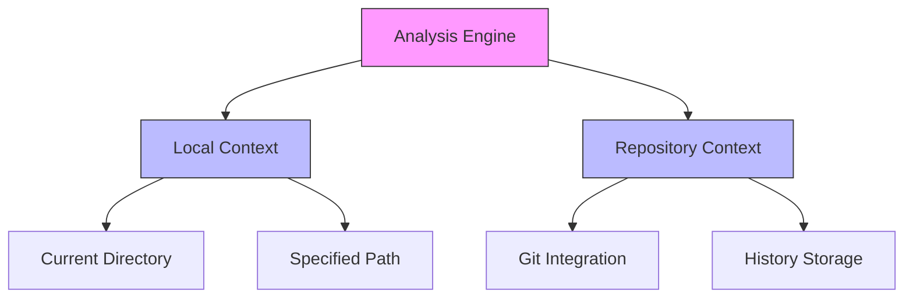
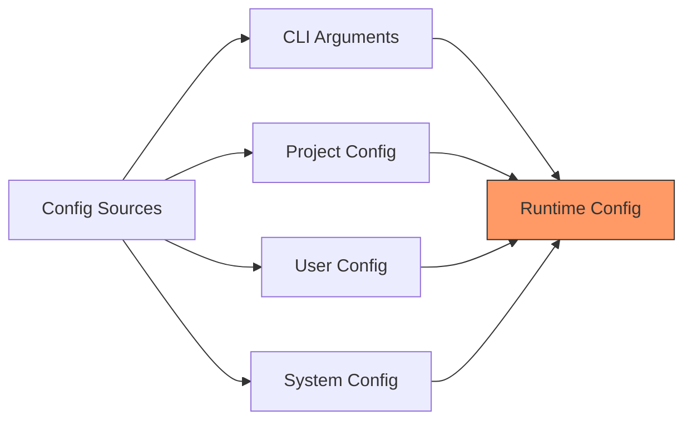
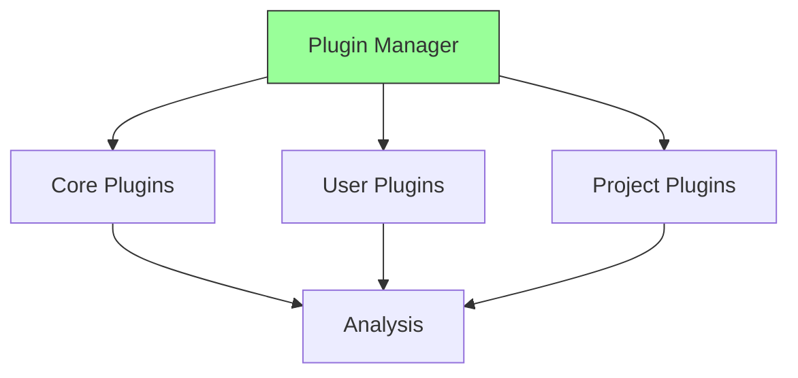
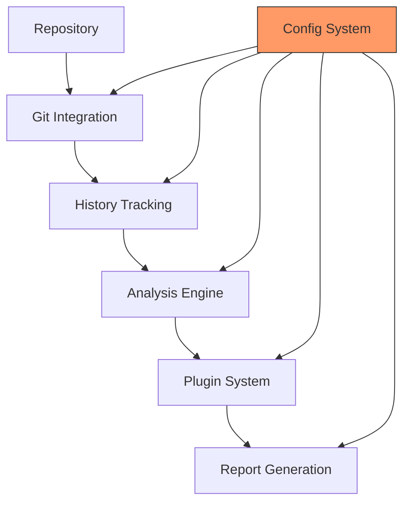

# Code Historian: Architectural Analysis & Functionality Review

## Core Architectural Principles vs. Implementation

### Repository Analysis Context

#### Current Implementation
```rust
// Current CLI approach
code-historian -r /path/to/repo
```

#### Logical Issues
1. **Path Specification Redundancy**
   - The `-r` flag is redundant when the tool is run from the target directory
   - Violates the principle of least surprise - most Git tools work in current directory
   - Creates unnecessary cognitive overhead

#### Expected Behavior
```bash
# In repository directory
code-historian

# Optional explicit path (only if analyzing different repo)
code-historian /path/to/other/repo
```

### Directory Structure & State Management

#### Current Implementation
```
.history/          # Hardcoded history directory
docs/history/      # Hardcoded output directory
```

#### Logical Issues
1. **History Directory**
   - Should follow Git-like patterns (.git, .svn)
   - Should be discoverable up directory tree
   - Should support XDG base directory specification

2. **Output Directory**
   - Should respect project structure
   - Should integrate with existing documentation patterns

#### Expected Behavior
```bash
# History directory discovery (in order)
1. .code-historian/        # Project-specific
2. XDG_DATA_HOME/code-historian/  # User-specific
3. ~/.local/share/code-historian/ # Default user-specific

# Output directory resolution (in order)
1. ./docs/code-history/   # Project documentation
2. ./.code-historian/     # Project-specific if no docs
3. XDG_DATA_HOME/code-historian/reports/  # User space
```

## Feature Implementation Analysis

### 1. Core Analysis Engine

#### Current State
- Git integration is direct but inflexible
- Analysis is tied to repository root
- Plugin system lacks clear boundaries

#### Required Changes


### 2. Configuration System

#### Current State
- Mixed CLI and file-based config
- Inconsistent precedence rules
- Hardcoded paths and values

#### Required Changes


### 3. Plugin Architecture

#### Current Issues
- Plugins are statically linked
- No dynamic loading capability
- Limited extension points

#### Required Changes


## Command Line Interface Redesign

### Current vs. Proposed

```bash
# Current (Problematic)
code-historian -r /path/to/repo -H .history -o docs/history

# Proposed (Logical)
cd /path/to/repo
code-historian                  # Analyze current directory
code-historian watch           # Watch mode
code-historian analyze path    # Analyze specific path
code-historian init            # Initialize history tracking
```

### Subcommand Structure
```
code-historian
├── analyze [path]        # Analyze repository
├── init                 # Initialize tracking
├── watch               # Watch for changes
├── config             # Manage configuration
│   ├── init          # Initialize config
│   ├── get           # Get config value
│   └── set           # Set config value
└── plugin            # Plugin management
    ├── list         # List plugins
    ├── install      # Install plugin
    └── remove       # Remove plugin
```

## Data Flow Architecture



## Implementation Priority Matrix

| Component | Priority | Complexity | Impact |
|-----------|----------|------------|--------|
| CLI Redesign | High | Low | High |
| Config System | High | Medium | High |
| History Management | High | Medium | High |
| Plugin Architecture | Medium | High | Medium |
| Watch System | Low | Medium | Low |

## Remediation Path

### Phase 1: Core Restructuring
1. Implement proper directory discovery
2. Remove redundant CLI arguments
3. Establish clear configuration hierarchy

### Phase 2: Architecture Enhancement
1. Redesign plugin system
2. Implement dynamic loading
3. Create proper extension points

### Phase 3: Feature Completion
1. Add subcommand structure
2. Implement configuration management
3. Complete plugin management

## Migration Strategy

### For Existing Users
```bash
# Automatic migration
code-historian migrate

# Manual migration
mv .history .code-historian
code-historian init --import-history
```

### For New Users
```bash
# Initialize new project
code-historian init

# Import existing history
code-historian import /path/to/old/history
```

## Testing Strategy

### Unit Tests
- Configuration resolution
- Directory discovery
- Plugin loading
- Analysis engine

### Integration Tests
- Full workflow scenarios
- Migration paths
- Plugin interactions
- Watch mode stability

### Performance Tests
- Large repository analysis
- Real-time watch mode
- Plugin overhead
- Memory usage patterns

## Conclusion

The current implementation suffers from logical inconsistencies and architectural decisions that violate the principle of least surprise. The remediation path outlined above will create a more intuitive, maintainable, and extensible system that better serves its users and maintains consistency with established development patterns. 