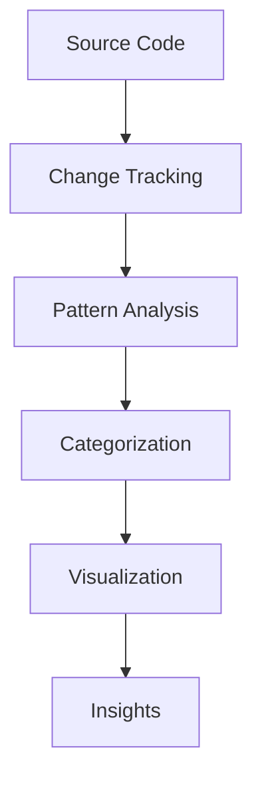

# Code Historian: Core Purpose & Evolution

## Original Vision

Code Historian was conceived as a specialized tool for understanding code evolution in software projects. The core purpose was to:

1. Track changes in source files over time
2. Categorize changes according to common software patterns
3. Generate meaningful visualizations of code evolution
4. Provide insights into development patterns



## Core Principles

### 1. Simplicity in Usage
The original implementation followed Unix philosophy:
```bash
# Original simple interface
code-historian [options] [path]

# Focus on current directory by default
cd your-project
code-historian
```

### 2. Intelligent Analysis
- Automatic categorization of changes into meaningful groups
- Pattern detection in code evolution
- Impact assessment of changes

### 3. Visual Understanding
- Timeline generation for code evolution
- Category distribution visualization
- Pattern visualization
- Impact analysis graphs

## Evolution of Features

### Initial Version (Shell Script)
- Basic file tracking in `.history` directory
- Simple diff analysis
- Markdown report generation
- Basic statistics (lines added/removed)

### Python Enhancement
- Timeline generation
- Basic visualization support
- Pattern matching improvements

### Rust Migration
- Performance improvements
- Enhanced analysis capabilities
- ML-based categorization
- Plugin system
- Real-time monitoring

## Core Categories

The tool has always focused on these fundamental change types:

1. **Structural Changes**
   - Architecture modifications
   - Component relationships
   - Code organization

2. **Functional Changes**
   - API modifications
   - Logic updates
   - Data handling

3. **Quality Changes**
   - Documentation
   - Testing
   - Error handling
   - Performance
   - Security

4. **Maintenance Changes**
   - Refactoring
   - Dependencies
   - Configuration

## Usage Philosophy

### 1. Non-Intrusive
- Works with existing repositories
- No special markup required
- Respects project structure

### 2. Flexible
- Language agnostic
- Customizable categories
- Multiple output formats

### 3. Informative
- Clear visualizations
- Detailed reports
- Actionable insights

## Command Structure

The command structure evolved to maintain simplicity while adding power:

```bash
# Core Commands
code-historian                    # Analyze current directory
code-historian analyze [path]     # Analyze specific path
code-historian init              # Initialize tracking
code-historian watch            # Monitor changes

# Configuration
code-historian config get <key>  # Get configuration
code-historian config set <key>  # Set configuration

# Plugin Management
code-historian plugin list      # List available plugins
code-historian plugin add       # Add new plugin
code-historian plugin remove    # Remove plugin
```

## Output Philosophy

### 1. Reports
- Markdown for human readability
- JSON for machine processing
- HTML for web viewing

### 2. Visualizations
- Timelines for evolution tracking
- Charts for distribution analysis
- Graphs for relationship mapping

### 3. Data
- Raw data for further analysis
- Integration-friendly formats
- Customizable templates

## Future Vision

The tool continues to evolve while maintaining its core purpose:

1. **Enhanced Analysis**
   - Machine learning integration
   - Advanced pattern recognition
   - Real-time analysis capabilities

2. **Improved Visualization**
   - Interactive timelines
   - 3D visualization options
   - Custom visualization plugins

3. **Extended Integration**
   - IDE plugins
   - CI/CD integration
   - Cloud deployment options

4. **Team Collaboration**
   - Shared insights
   - Team metrics
   - Collaborative analysis

## Design Principles

1. **Intuitive Interface**
   - Git-like command structure
   - Sensible defaults
   - Progressive complexity

2. **Reliable Analysis**
   - Accurate categorization
   - Consistent results
   - Verifiable insights

3. **Extensible Architecture**
   - Plugin system
   - Custom analyzers
   - Flexible output formats

4. **Performance Focus**
   - Efficient processing
   - Scalable analysis
   - Resource-conscious operation 