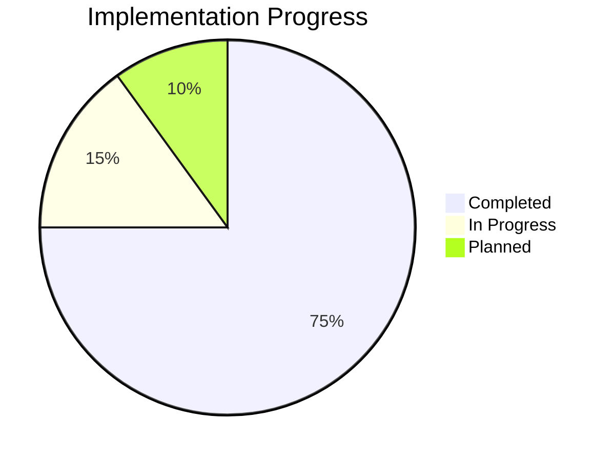
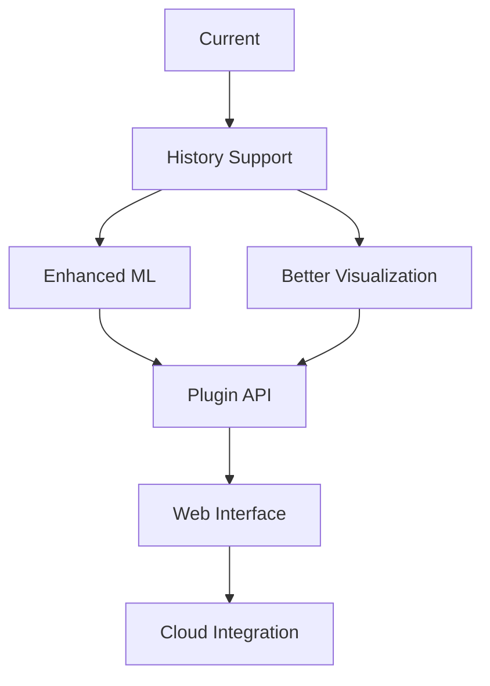
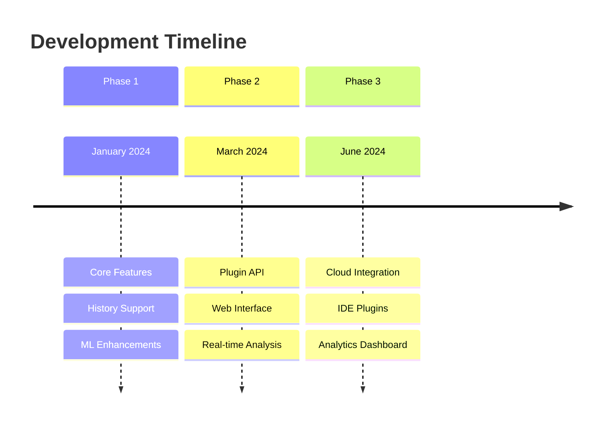
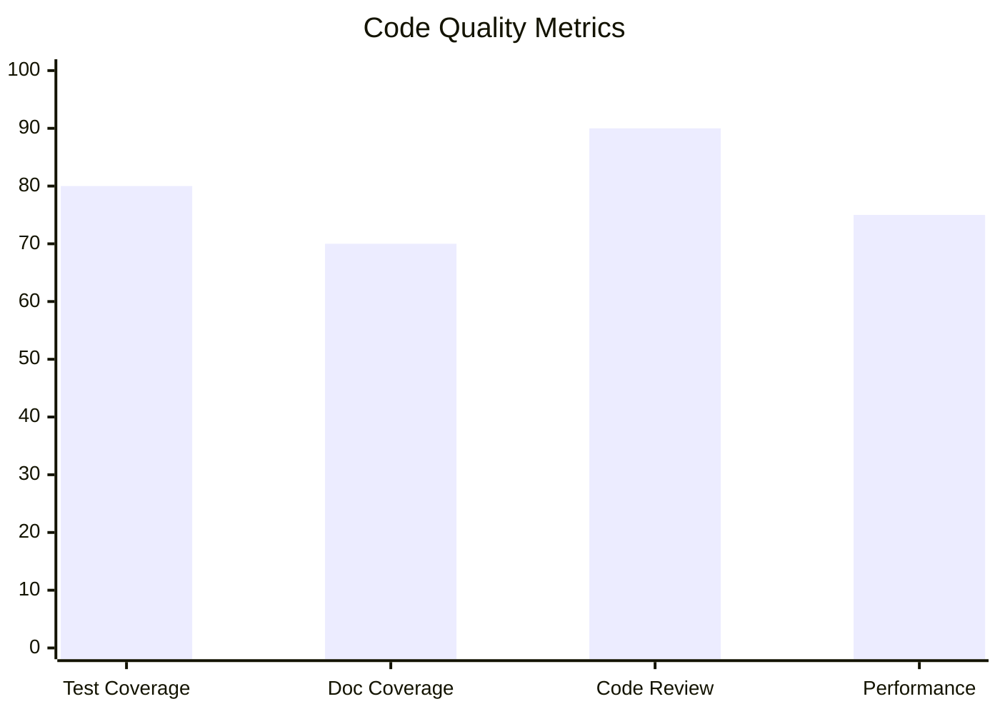
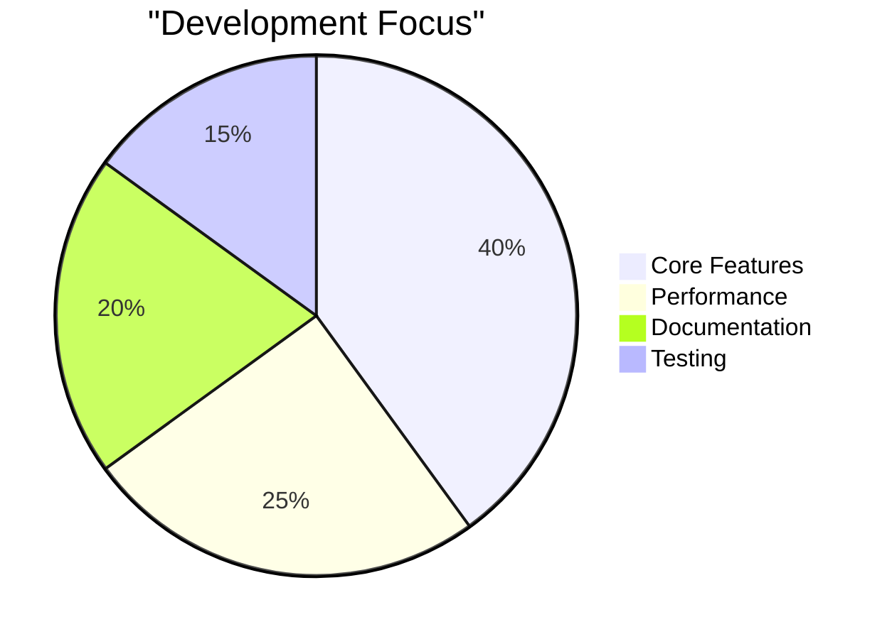
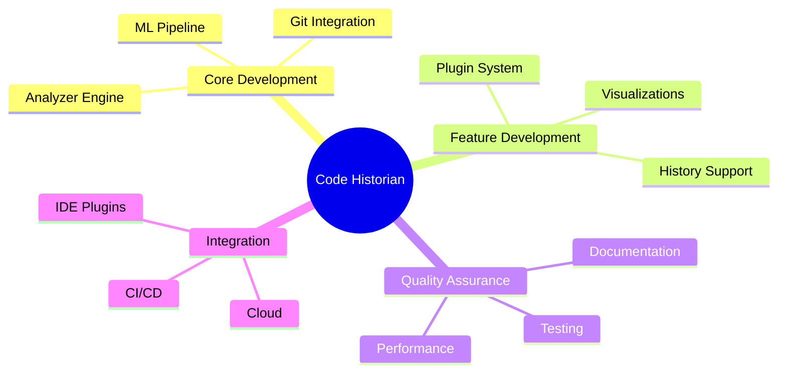

# Development Progress

## Current Status

## Completed Features

- [x] Core analyzer engine
- [x] Git integration
- [x] Basic ML categorization
- [x] Plugin system architecture
- [x] Report generation
- [x] Basic visualizations
- [x] Command-line interface
- [x] Error handling system
- [x] Test infrastructure

## In Progress

- [ ] History directory support
  - [x] Basic detection
  - [ ] User prompting
  - [ ] Path validation
  - [ ] Auto-creation
- [ ] Enhanced ML capabilities
  - [x] Rule-based fallback
  - [ ] Model training pipeline
  - [ ] Custom model support
- [ ] Advanced visualizations
  - [x] Timeline generation
  - [x] Category distribution
  - [ ] Interactive graphs

## Planned Features

### Short-term (Next 30 days)
- [ ] History directory management
- [ ] Configuration file support
- [ ] Enhanced error recovery
- [ ] Progress indicators
- [ ] Parallel commit processing

### Medium-term (60-90 days)
- [ ] Real-time analysis mode
- [ ] Custom plugin API
- [ ] Web interface
- [ ] Database backend
- [ ] Remote repository support

### Long-term (90+ days)
- [ ] CI/CD integration
- [ ] IDE plugins
- [ ] Cloud deployment
- [ ] Analytics dashboard
- [ ] Team collaboration features

## Known Issues

1. Performance bottlenecks
   - Large repository processing
   - Memory usage optimization
   - Visualization generation speed

2. Feature gaps
   - Limited ML model accuracy
   - Basic plugin capabilities
   - Simple visualization options

3. Technical debt
   - Error handling refinement
   - Documentation updates
   - Test coverage expansion

## Next Steps

## Milestones

## Performance Metrics

### Current
- Repository processing: ~100 commits/second
- Memory usage: ~50MB base, ~200MB peak
- Visualization generation: ~2 seconds
- Plugin execution: ~50ms/plugin

### Targets
- Repository processing: 500+ commits/second
- Memory usage: ~30MB base, ~100MB peak
- Visualization generation: <1 second
- Plugin execution: <10ms/plugin

## Quality Metrics

## Resource Allocation

## Risk Assessment

### High Priority
- Performance optimization for large repositories
- ML model accuracy improvements
- Plugin system stability

### Medium Priority
- Documentation completeness
- User interface refinements
- Cross-platform testing

### Low Priority
- Additional visualization types
- Minor feature enhancements
- Code style consistency

## Team Assignments

