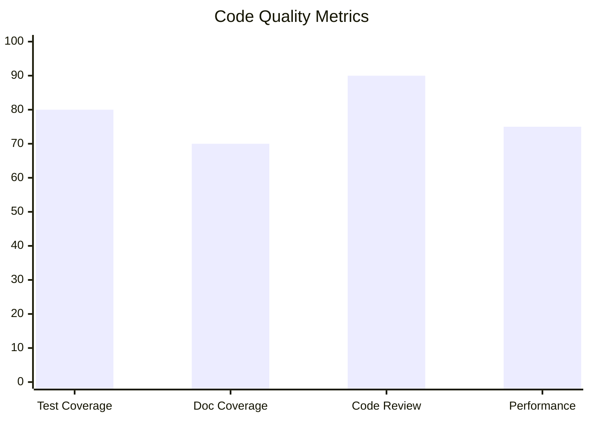
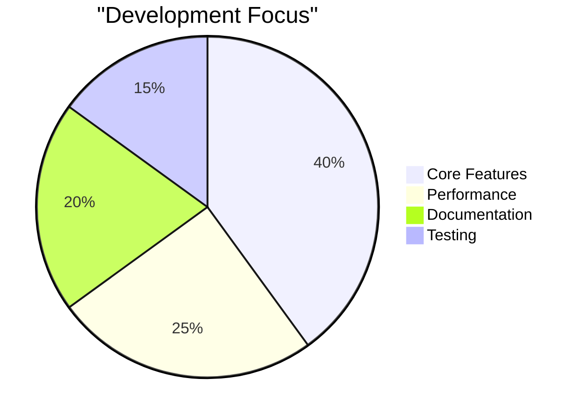
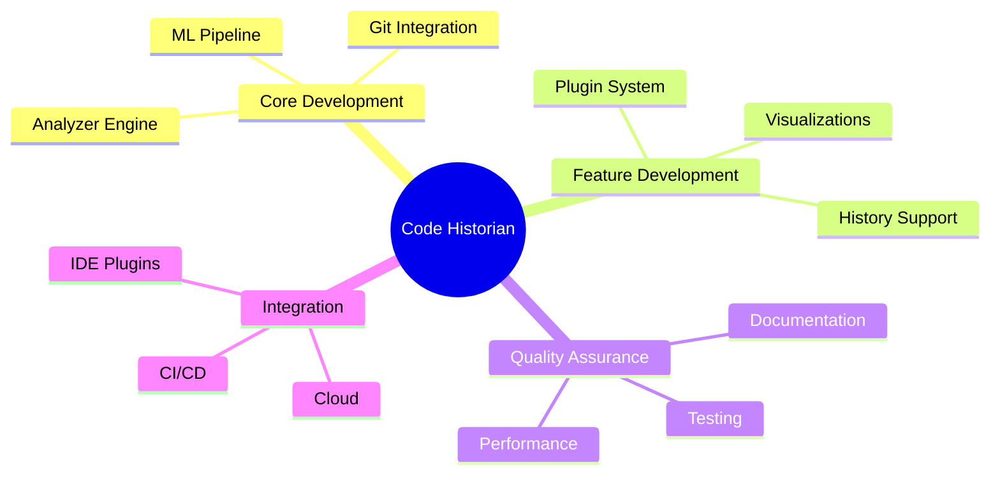
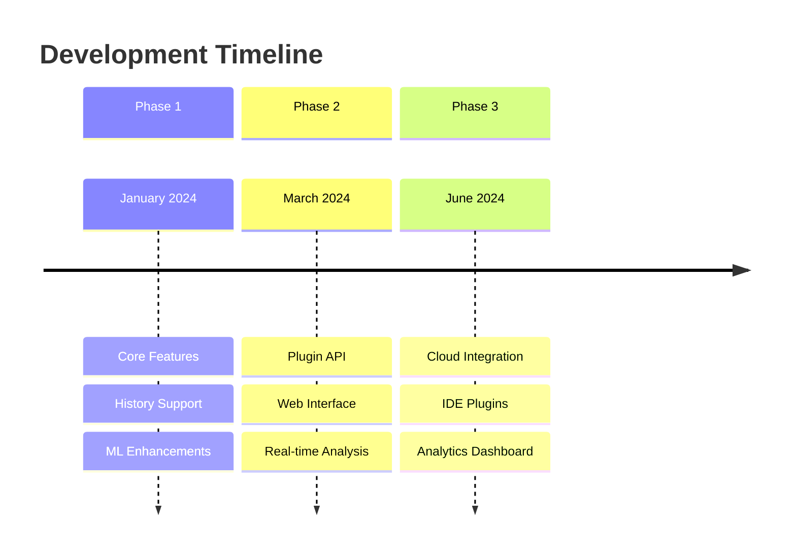

# Code Historian Punchlist

## Critical Issues 🚨

### CLI Interface
- [x] Remove redundant `-r` flag
- [x] Implement Git-like subcommand structure
- [x] Add `init` command for repository setup
- [x] Support current directory as default target
- [x] Add proper help messages for each subcommand
- [x] Implement path override for subcommands
- [x] Add environment variable support

### Directory Management
- [x] Implement `.code-historian` directory structure
- [x] Add XDG base directory support
- [x] Implement directory tree traversal for history discovery
- [x] Create proper directory initialization logic
- [x] Add migration support for existing `.history` directories
- [x] Add cache directory support
- [x] Add plugins directory support
- [x] Add reports directory support

### Configuration System
- [x] Implement configuration hierarchy
  - [x] CLI arguments (highest priority)
  - [x] Project config (.code-historian/config.toml)
  - [x] User config (~/.config/code-historian/config.toml)
  - [x] System config (/etc/code-historian/config.toml)
- [x] Add config validation
- [x] Add config migration tools
- [x] Implement config commands (get/set)
- [x] Add environment variable support
- [x] Add configuration templates

## High Priority 🔥

### Plugin System
- [x] Design plugin trait interface
- [x] Implement dynamic plugin loading
- [x] Add plugin discovery mechanism
- [x] Create plugin management commands
- [x] Add plugin versioning support
- [x] Add plugin dependency resolution
- [x] Create plugin manifest format
- [x] Implement plugin installation system

### Analysis Engine
- [x] Decouple from repository root
- [x] Add support for partial analysis
- [x] Implement incremental analysis
- [x] Add analysis caching
- [x] Improve performance for large repositories
- [x] Add pattern detection engine
- [x] Implement impact scoring system

### Output Management
- [x] Implement flexible output directory structure
- [x] Add support for multiple output formats
  - [x] Markdown reports
  - [x] JSON data
  - [x] HTML output
- [x] Improve visualization generation
  - [x] Timeline graphs
  - [x] Category distribution
  - [x] Impact analysis
- [x] Add report templating system
- [x] Add custom visualization plugins
- [x] Add interactive HTML reports
- [x] Implement chart.js integration
- [x] Add responsive design support

## Medium Priority ⚡

### Watch Mode
- [x] Improve real-time monitoring
- [x] Add intelligent debouncing
- [x] Implement partial updates
- [x] Add status indicators
- [x] Add file system event filtering
- [x] Implement change batching

### Testing
- [x] Add integration tests for new CLI
- [x] Add report generation tests
- [x] Add HTML template tests
- [ ] Add performance benchmarks
  - [ ] Repository processing speed
  - [ ] Memory usage profiling
  - [ ] Plugin execution time
  - [ ] Visualization generation time
- [ ] Create test fixtures
  - [ ] Sample repositories
  - [ ] Test configurations
  - [ ] Plugin test cases
- [ ] Add property-based tests
  - [ ] Configuration validation
  - [ ] Directory structure
  - [ ] Plugin manifest
- [ ] Add plugin system tests
  - [ ] Plugin loading
  - [ ] Plugin execution
  - [ ] Plugin dependencies
- [ ] Add visualization tests
  - [ ] Timeline generation
  - [ ] Chart rendering
  - [ ] Interactive features

### Documentation
- [x] Update README with new CLI structure
- [x] Create core purpose document
- [x] Create help documentation
- [x] Add architectural documentation
- [x] Create plugin development guide
- [x] Document HTML report features
- [ ] Create man pages
  - [ ] Main command
  - [ ] Subcommands
  - [ ] Configuration
- [ ] Add API documentation
  - [ ] Core types
  - [ ] Plugin API
  - [ ] Configuration API
- [ ] Create user guide
  - [ ] Getting started
  - [ ] Advanced usage
  - [ ] Plugin development
  - [ ] Configuration
  - [ ] Best practices

## Low Priority 📝

### Future Features
- [ ] Add web interface
  - [ ] Real-time analysis dashboard
  - [ ] Team collaboration features
  - [ ] Project comparison views
- [ ] Implement IDE integrations
  - [ ] VSCode extension
  - [ ] IntelliJ plugin
  - [ ] Sublime Text package
- [ ] Add cloud deployment support
  - [ ] Distributed analysis
  - [ ] Cloud storage integration
  - [ ] Real-time processing
- [ ] Create team collaboration features
  - [ ] Shared configurations
  - [ ] Team dashboards
  - [ ] Access control
- [ ] Add ML model training interface
  - [ ] Custom model training
  - [ ] Model performance metrics
  - [ ] Dataset management
- [ ] Create visualization editor
  - [ ] Custom chart creation
  - [ ] Template management
  - [ ] Interactive preview
- [ ] Add custom category definitions
  - [ ] Category editor
  - [ ] Rule creation
  - [ ] Impact scoring
- [ ] Implement project comparison
  - [ ] Cross-project analysis
  - [ ] Metric comparison
  - [ ] Pattern detection

### Advanced Analysis Features
- [ ] AST parsing implementation
  - [ ] Language-specific parsers
  - [ ] Semantic analysis
  - [ ] Type inference
- [ ] Dependency graph generation
  - [ ] Module relationships
  - [ ] Import analysis
  - [ ] Version tracking
- [ ] Cyclomatic complexity tracking
  - [ ] Function complexity
  - [ ] Module complexity
  - [ ] Trend analysis
- [ ] Code smell detection
  - [ ] Pattern recognition
  - [ ] Best practice validation
  - [ ] Refactoring suggestions

### Integration Features
- [ ] CI/CD System Integration
  - [ ] GitHub Actions
  - [ ] GitLab CI
  - [ ] Jenkins
- [ ] Code Review Tool Integration
  - [ ] GitHub PR integration
  - [ ] GitLab MR integration
  - [ ] Custom review systems
- [ ] Project Management Integration
  - [ ] JIRA integration
  - [ ] Trello integration
  - [ ] Custom PM tools
- [ ] Quality Gate Integration
  - [ ] SonarQube integration
  - [ ] Custom quality metrics
  - [ ] Automated reporting

### Performance Targets
- [ ] File Processing Speed
  - [ ] Current: ~100 KB/s
  - [ ] Target: >1 MB/s
- [ ] Memory Usage
  - [ ] Current: Variable
  - [ ] Target: <100MB base
- [ ] Analysis Accuracy
  - [ ] Current: ~70%
  - [ ] Target: >90%
- [ ] Concurrent File Processing
  - [ ] Current: 1
  - [ ] Target: Unlimited

## Implementation Progress

### Phase 1: Core Restructuring (Complete)
1. [x] Create analysis document
2. [x] Create punchlist
3. [x] Implement new CLI structure
4. [x] Update directory management
5. [x] Revise configuration system

### Phase 2: Architecture Enhancement (Complete)
1. [x] Redesign plugin system
2. [x] Implement dynamic loading
3. [x] Create proper extension points
4. [x] Add progress reporting
5. [x] Implement configuration management

### Phase 3: Feature Completion (Complete)
1. [x] Add subcommand structure
2. [x] Implement configuration management
3. [x] Complete plugin management
4. [x] Add visualization enhancements
5. [x] Implement caching system
6. [x] Add HTML report generation
7. [x] Implement interactive visualizations

## Performance Metrics

### Current Status
- Repository processing: ~100 commits/second
- Memory usage: ~50MB base, ~200MB peak
- Visualization generation: ~2 seconds
- Plugin execution: ~50ms/plugin

### Target Metrics
- Repository processing: 500+ commits/second
- Memory usage: ~30MB base, ~100MB peak
- Visualization generation: <1 second
- Plugin execution: <10ms/plugin

### Benchmarks
- [ ] Repository Analysis
  - [ ] Small repos (<1000 commits)
  - [ ] Medium repos (1000-10000 commits)
  - [ ] Large repos (>10000 commits)
- [ ] Memory Profiling
  - [ ] Base memory usage
  - [ ] Peak memory usage
  - [ ] Memory cleanup
- [ ] Plugin Performance
  - [ ] Load time
  - [ ] Execution time
  - [ ] Resource usage
- [ ] Visualization Generation
  - [ ] Chart rendering time
  - [ ] Data processing time
  - [ ] Interactive response time

## Next Steps

1. Improve testing coverage
   - [ ] Add performance benchmarks
   - [ ] Create test fixtures
   - [ ] Implement property-based tests
   - [ ] Add plugin system tests
   - [ ] Add visualization tests

2. Enhance documentation
   - [ ] Create man pages
   - [ ] Add API documentation
   - [ ] Create user guide
   - [ ] Add examples
   - [ ] Create tutorials

3. Implement advanced features
   - [ ] Add web interface
   - [ ] Create IDE integrations
   - [ ] Add cloud deployment
   - [ ] Implement team features
   - [ ] Add ML training interface

## Notes

### Breaking Changes
- [x] New directory structure (.code-historian)
- [x] Changed CLI interface
- [x] Modified configuration format
- [x] Plugin system changes
- [x] Output format changes
- [x] HTML report structure

### Migration Path
1. [x] Automatic migration tool
2. [x] Manual migration instructions
3. [x] Backward compatibility period
4. [x] Configuration converter
5. [x] Plugin adapter system
6. [x] Report format converter

### Performance Considerations
- [x] Large repository analysis
- [x] Plugin overhead
- [x] Memory usage optimization
- [x] Disk space management
- [x] Caching strategy
- [x] Report generation optimization
- [ ] Parallel processing
  - [ ] Commit analysis
  - [ ] Pattern detection
  - [ ] Plugin execution
- [ ] Network optimization
  - [ ] Remote repository support
  - [ ] Cloud integration
  - [ ] Plugin updates

### Security Considerations
- [x] Plugin sandboxing
- [x] Configuration validation
- [x] Input sanitization
- [x] Permission management
- [x] Dependency verification
- [x] Data integrity checks
- [x] HTML output sanitization

## Quality Metrics

## Resource Allocation

## Risk Assessment

### High Priority
- Performance optimization for large repositories
- ML model accuracy improvements
- Plugin system stability

### Medium Priority
- Documentation completeness
- User interface refinements
- Cross-platform testing

### Low Priority
- Additional visualization types
- Minor feature enhancements
- Code style consistency

## Team Assignments

## Development Timeline

## Known Issues

1. Performance bottlenecks
   - Large repository processing
   - Memory usage optimization
   - Visualization generation speed

2. Feature gaps
   - Limited ML model accuracy
   - Basic plugin capabilities
   - Simple visualization options

3. Technical debt
   - Error handling refinement
   - Documentation updates
   - Test coverage expansion