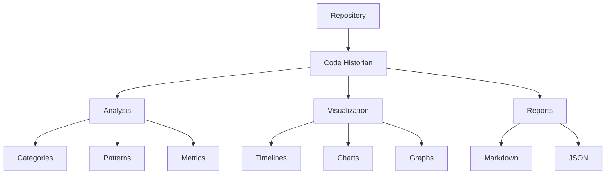

# Code Historian

A powerful tool for analyzing the evolution of code in software projects. Code Historian tracks changes in source files, categorizes them according to common software patterns, and generates detailed reports with visual timelines.



## Features

### Core Features ✨
- [x] **Smart Change Detection**: Automatically categorizes changes into 15 different categories
- [x] **Visual Timelines**: Generate visual representations of code evolution
- [x] **Detailed Statistics**: Track lines added, removed, and net changes
- [x] **Git Integration**: Deep integration with Git repositories
- [x] **Plugin System**: Extensible analysis capabilities
- [x] **ML-Based Categorization**: Optional machine learning for better categorization

### Analysis Categories 📊
- Architecture (structural changes)
- API (interface changes)
- Logic (flow modifications)
- Data (structure changes)
- Error Handling
- Logging
- Documentation
- Testing
- Performance
- Security
- Refactoring
- Dependencies
- Configuration
- UI/UX
- Accessibility

### Interaction Modes 🔄
- [x] **Command Line**: Traditional CLI interface
- [x] **Interactive Mode**: Guided configuration and analysis
- [x] **Watch Mode**: Real-time monitoring and analysis
- [x] **Configuration Files**: Persistent settings management

## Development Setup

### Prerequisites
- Rust 1.70+
- Git
- Graphviz (for visualizations)

### Building from Source
```bash
# Clone repository
git clone https://github.com/abcdqfr/code-historian.git
cd code-historian

# Build the project
cargo build --release

# Run tests
cargo test

# Install locally
cargo install --path .
```

## Usage

### Repository Setup
```bash
# Initialize a new repository for tracking
cd your-project
code-historian init

# Import existing history
code-historian init --import-history /path/to/old/history
```

### Basic Analysis
```bash
# Analyze current directory
code-historian analyze

# Analyze with visualizations
code-historian analyze -v

# Watch for changes
code-historian watch

# Analyze specific directory
code-historian /path/to/repo analyze
```

### Advanced Usage
```bash
# Enable ML categorization with visualizations
code-historian analyze --ml -v

# Analyze with specific plugins
code-historian analyze -p "security,performance"

# Watch with custom debounce time (seconds)
code-historian watch --debounce 5

# Recursive analysis with file pattern
code-historian analyze --recursive -p "*.rs"

# Custom output directory
code-historian analyze -o /path/to/output
```

### Configuration Management
```bash
# Initialize configuration
code-historian config init

# Get configuration value
code-historian config get visualization.theme

# Set configuration value
code-historian config set visualization.theme "modern"
```

### Plugin Management
```bash
# List available plugins
code-historian plugin list

# Install plugin
code-historian plugin install security-analyzer

# Remove plugin
code-historian plugin remove security-analyzer
```

## Configuration

### Project Configuration
Create `.code-historian/config.toml` in your project:
```toml
default_output_dir = "docs/code-history"
preferred_plugins = ["security", "performance"]
default_ml_enabled = true

[visualization]
theme = "modern"
timeline_style = "compact"
chart_style = "dark"
color_scheme = ["#4C9AFF", "#F66D44", "#6C8EBF"]
```

### User Configuration
Located at `~/.config/code-historian/config.toml` (Linux/macOS) or `%APPDATA%\code-historian\config.toml` (Windows).

### System Configuration
Located at `/etc/code-historian/config.toml` (Linux/macOS).

## Output

### Reports
- **Markdown**: Detailed change history with categorization
- **JSON**: Machine-readable analysis data
- **Visualizations**: Timelines, charts, and graphs

### Example Output Structure
```
docs/code-history/
├── REPORT.md           # Main analysis report
├── timeline.png        # Visual timeline
├── categories.png      # Category distribution
├── impact.png         # Impact analysis
└── data.json          # Raw analysis data
```

## Development Status

### Implemented ✅
- Core analysis engine
- Git integration
- Basic ML categorization
- Plugin system
- Report generation
- Basic visualizations
- Interactive mode
- Watch mode
- Configuration system

### In Progress 🚧
- Enhanced ML capabilities
- Advanced visualization options
- Real-time analysis improvements
- Plugin marketplace

### Planned 📋
- Web interface
- IDE integrations
- Cloud deployment
- Team collaboration features

## Contributing

We welcome contributions! Please see [CONTRIBUTING.md](CONTRIBUTING.md) for guidelines.

## License

This project is licensed under the MIT License - see the [LICENSE](LICENSE) file for details.