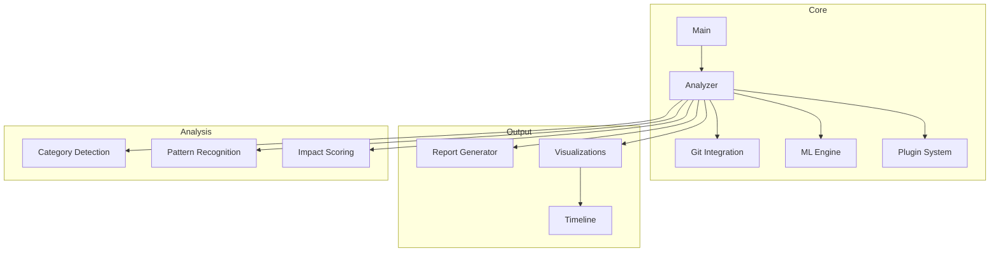
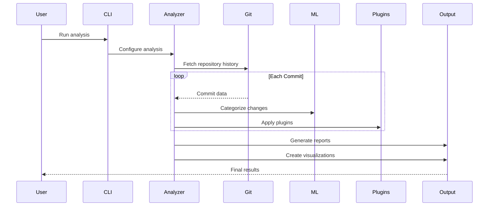
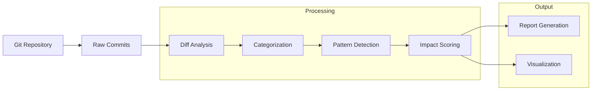
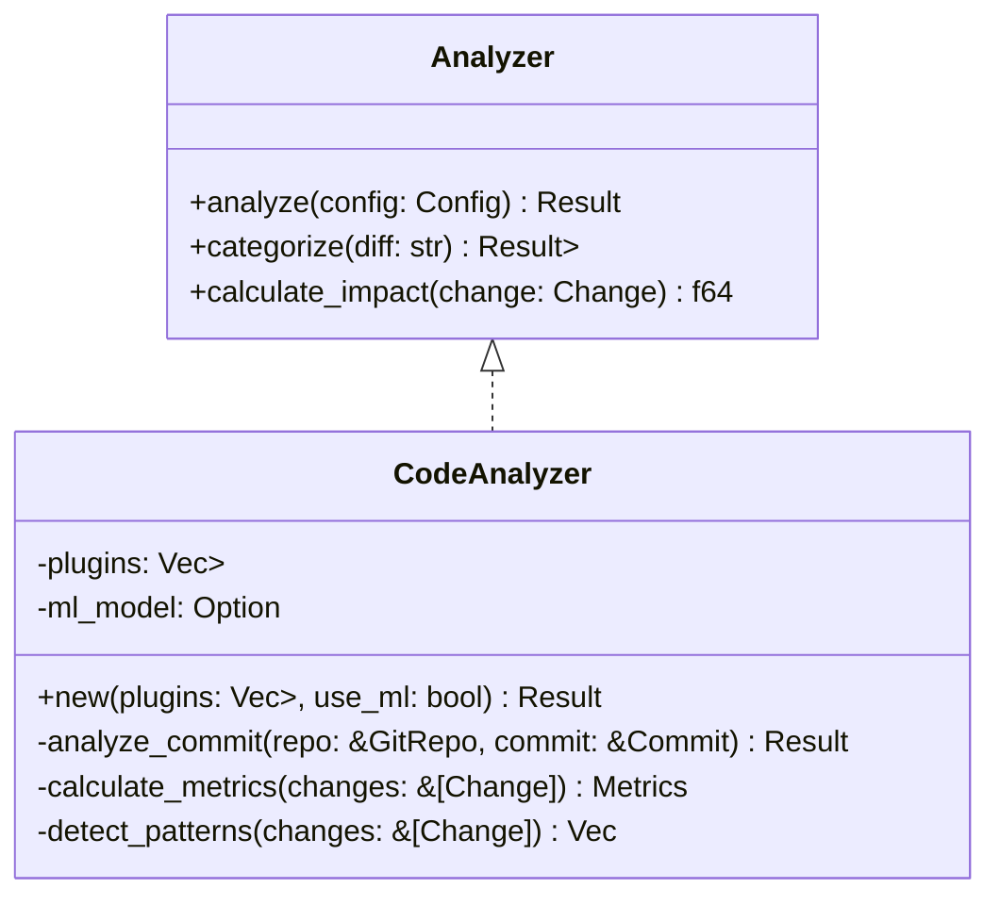
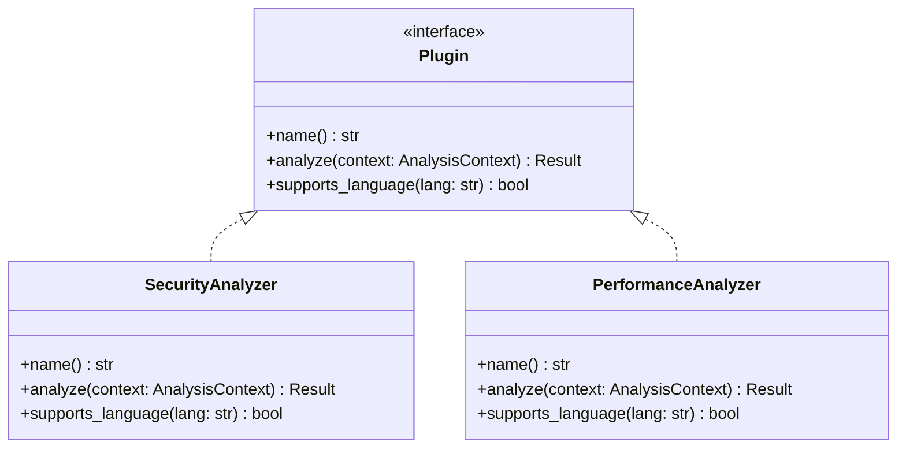
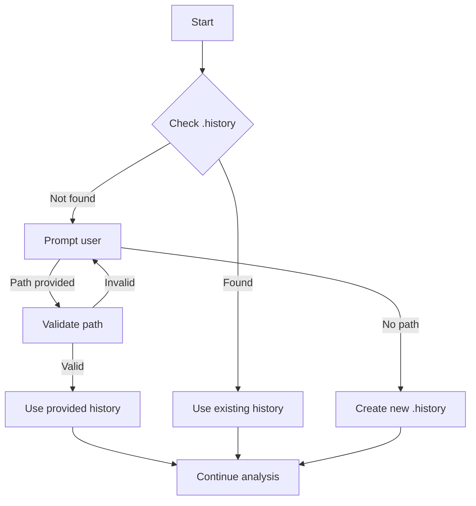
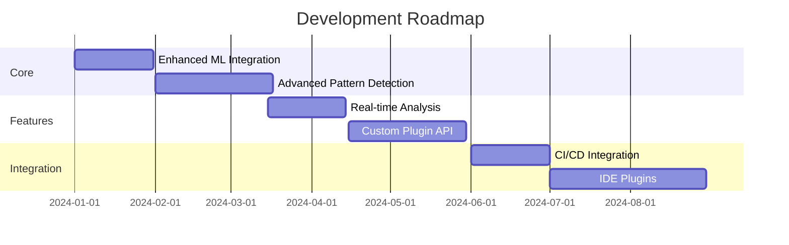
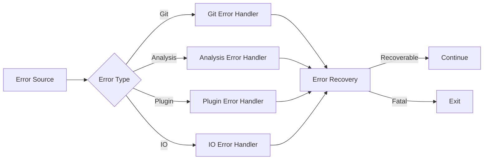

# Code Historian Architecture

## Project Structure



## Directory Structure

```
code-historian-rs/
├── Cargo.toml               # Project dependencies and metadata
├── docs/                    # Documentation directory
│   ├── ARCHITECTURE.md      # This file
│   └── PROGRESS.md         # Development progress tracking
├── src/
│   ├── main.rs             # Entry point and CLI handling
│   ├── lib.rs              # Core types and traits
│   ├── analyzer.rs         # Code analysis engine
│   ├── git.rs              # Git repository interaction
│   ├── ml.rs               # Machine learning categorization
│   ├── plugin.rs           # Plugin system implementation
│   ├── report.rs           # Report generation
│   └── visualization.rs     # Data visualization
└── tests/                   # Integration tests
    └── integration/        # Test scenarios
```

## Component Interaction



## Data Flow



## Core Components

### Analyzer Engine
The analyzer engine is the heart of Code Historian, responsible for:
- Processing Git commits
- Categorizing changes
- Detecting patterns
- Calculating impact scores



### Plugin System
The plugin system allows for extensible analysis capabilities:



## Configuration

The program supports various configuration options through both CLI and configuration files:

```rust
pub struct Config {
    pub repo_path: PathBuf,
    pub output_dir: PathBuf,
    pub plugins: Vec<String>,
    pub ml_enabled: bool,
    pub visualization_enabled: bool,
    pub recursive: bool,
    pub file_pattern: Option<String>,
}
```

## History Directory Detection

The program now includes functionality to detect and work with `.history` directories:



## Output Formats

The program generates various output formats:

1. **Markdown Reports**
   - Summary statistics
   - Category distribution
   - Pattern analysis
   - Impact assessment

2. **Visualizations**
   - Timeline graphs
   - Category distribution charts
   - Impact score timelines

3. **JSON Data**
   - Machine-readable format
   - Integration-friendly
   - Complete analysis data

## Future Enhancements



## Performance Considerations

The program implements various optimizations:

1. **Parallel Processing**
   - Commit analysis
   - Pattern detection
   - Plugin execution

2. **Caching**
   - Git object caching
   - Analysis results
   - ML model predictions

3. **Memory Management**
   - Streaming large repositories
   - Efficient diff handling
   - Resource cleanup

## Error Handling



## Contributing

See [CONTRIBUTING.md](CONTRIBUTING.md) for guidelines on:
- Code style
- Testing requirements
- Documentation standards
- Pull request process 