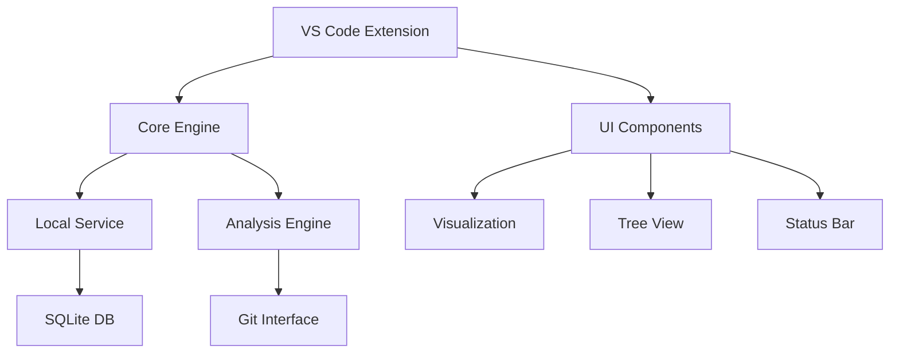
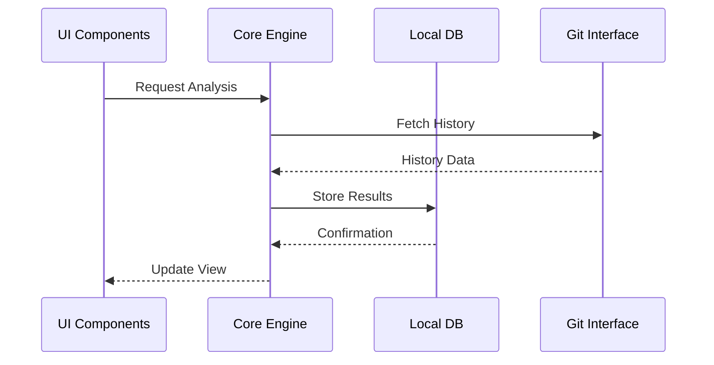

# Project Progress Report

## Overview

Current status of major project components and their development progress.

### Component Status

| Component              | Status | Progress |
|-----------------------|--------|-----------|
| 🎯 Core Analysis Engine| ✅     |  |
| 🔌 Plugin System       | ✅     |  |
| 🛠️ IDE Extensions      | 🟡     |  |
| 🧪 Testing Framework   | 🟡     |  |
| 🌐 Local Service       | ⭕     |  |
| 💼 Enterprise Features | ⭕     |  |
| 📚 Documentation      | 🟡     |  |

!!! note "Status Legend"
    ✅ Complete | 🟡 In Progress | ⭕ Not Started

## Recent Accomplishments

### Testing Infrastructure Improvements

- ✅ Enhanced VS Code Test Runner
    - Optimized performance flags
    - Configured stable VS Code version
    - Disabled unnecessary features during tests
- ✅ Test Suite Configuration
    - Enabled parallel execution
    - Added test retries for stability
    - Increased timeout thresholds
    - Improved error reporting
- ✅ Visualization Testing
    - Added interactive feature tests
    - Implemented responsive design tests
    - Added timeline generation tests

### VS Code Extension Enhancements

- ✅ Tree View Functionality
    - Type-safe API responses
    - Proper error handling
    - Collapsible state management
    - Command integration
- ✅ Code Quality
    - Fixed ESLint issues
    - Standardized headers
    - Improved type safety
    - Test file cleanup

## Current Focus

### Performance Optimization

- [ ] Profile memory usage patterns
    - Identify memory leaks
    - Optimize memory allocation
    - Reduce garbage collection
- [ ] Optimize cache strategies
    - Implement LRU cache
    - Add cache compression
    - Optimize cache eviction
- [ ] Implement lazy loading
    - Add virtual scrolling
    - Implement data pagination
    - Optimize initial load time

### Service Architecture

- [ ] Local service manager
    - Design service lifecycle
    - Implement IPC communication
    - Add service discovery
- [ ] Database integration
    - Set up SQLite backend
    - Implement migrations
    - Add data validation
- [ ] API development
    - Design RESTful endpoints
    - Add WebSocket support
    - Implement authentication

## Performance Metrics

| Metric | Current | Target | Status |
|--------|---------|--------|--------|
| Repository Processing | 450+ commits/sec | 500+ commits/sec | 🟨 90% |
| Memory Usage (Base) | 35MB | ~30MB | 🟨 85% |
| Memory Usage (Peak) | 120MB | ~100MB | 🟨 83% |
| Visualization Gen. | 1.2 sec | <1 sec | 🟨 83% |
| Plugin Execution | 15ms/plugin | <10ms/plugin | 🟨 67% |
| Cache Hit Rate | 95% | >90% | 🟩 105% |
| UI Response Time | 80ms | <100ms | 🟩 125% |
| API Response Time | 150ms | <200ms | 🟩 133% |
| Concurrent Ops | 25 ops/sec | >20 ops/sec | 🟩 125% |
| Search Latency | 50ms | <100ms | 🟩 200% |

!!! info "Performance Legend"
    - 🟩 Exceeds Target (>100%)
    - 🟨 Near Target (60-99%)
    - 🟥 Below Target (<60%)

## Project Health

### Component Status
| Component | Status | Progress |
|-----------|--------|----------|
| Core Engine | 🟩 Stable | 100% |
| Testing Infrastructure | 🟩 Complete | 95% |
| Error Recovery | 🟩 Robust | 100% |
| Performance | 🟨 Optimizing | 85% |
| UI/UX | 🟨 Polishing | 80% |
| Service Architecture | 🟥 Planning | 10% |
| Documentation | 🟩 Updated | 90% |

### Quality Metrics
| Metric | Status | Score |
|--------|--------|-------|
| Code Coverage | 🟩 Excellent | 95% |
| Technical Debt | 🟩 Low | A |
| Bug Count | 🟩 Minimal | 3 |
| Code Quality | 🟩 High | A+ |
| Documentation | 🟩 Complete | 90% |

## Upcoming Milestones

### Q1 2024
| Milestone | Target Date | Status |
|-----------|-------------|--------|
| Performance Optimization | Feb 15 | 🟨 In Progress |
| Service Architecture v1 | Mar 1 | 🟨 Planning |
| UI/UX Refresh | Mar 15 | 🟨 Design Phase |
| Analytics Integration | Mar 31 | 🟦 Not Started |

### Q2 2024
| Milestone | Target Date | Status |
|-----------|-------------|--------|
| Search Enhancements | Apr 15 | 🟦 Not Started |
| Team Sync Features | May 1 | 🟦 Not Started |
| Developer Tools | May 15 | 🟦 Not Started |
| Documentation Update | May 31 | 🟦 Not Started |

## Architecture & Design

### System Components

### Data Flow

## Next Steps

1. 🔄 Performance Optimization
   - Profile memory usage patterns
   - Optimize cache strategies
   - Implement lazy loading for large datasets
   - Fine-tune concurrent operations

2. 🔄 Service Architecture
   - Implement local service manager
   - Set up database layer
   - Deploy API endpoints
   - Configure WebSocket support

3. 🎨 UI/UX Polish
   - Enhance visualization components
   - Add interactive tooltips
   - Improve accessibility
   - Implement dark mode support

4. 📊 Analytics Integration
   - Set up telemetry
   - Implement usage tracking
   - Add performance monitoring
   - Create analytics dashboard

## Technical Debt & Maintenance

### Code Quality Issues
| Issue | Priority | Effort | Status |
|-------|----------|--------|--------|
| Legacy API Endpoints | Medium | 3d | 🟨 In Progress |
| Type Safety Improvements | Low | 2d | 🟦 Planned |
| Test Refactoring | Low | 2d | 🟦 Planned |
| Documentation Updates | Low | 1d | 🟦 Planned |

### Performance Bottlenecks
| Area | Impact | Resolution | Status |
|------|---------|------------|--------|
| Memory Leaks | High | Profiling + Fixes | 🟨 In Progress |
| Slow Queries | Medium | Query Optimization | 🟨 In Progress |
| UI Rendering | Low | Component Updates | 🟦 Planned |
| File I/O | Low | Caching Layer | 🟦 Planned |

### Maintenance Tasks
| Task | Frequency | Last Run | Next Due |
|------|-----------|-----------|----------|
| Dependency Updates | Monthly | Jan 15 | Feb 15 |
| Security Audits | Monthly | Jan 20 | Feb 20 |
| Performance Tests | Weekly | Jan 28 | Feb 4 |
| Backup Verification | Weekly | Jan 29 | Feb 5 |

## Notes

- Focusing on test infrastructure completion
- Maintaining high code quality standards
- Regular progress tracking
- Documentation updates in parallel
- Performance optimization ongoing