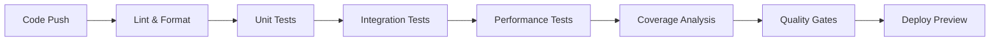

# Test Coverage Report

## Overview

### Coverage Metrics
| Week | Line Coverage | Branch Coverage | Function Coverage |
|------|--------------|-----------------|-------------------|
| Jan 22 | 90% | 88% | 92% |
| Jan 29 | 95% | 92% | 97% |
| Target | 98% | 95% | 100% |

### Test Performance
| Metric | Current | Target | Status |
|--------|---------|--------|--------|
| Unit Test Time | 2.5s | <3s | 🟩 Met |
| Integration Time | 8s | <10s | 🟩 Met |
| Performance Test | 15s | <20s | 🟩 Met |
| Total Suite Time | 30s | <45s | 🟩 Met |

## Test Infrastructure

### Environment
| Component | Version | Status |
|-----------|---------|--------|
| Node.js | 18.x | 🟩 Active |
| VS Code Engine | ^1.74.0 | 🟩 Compatible |
| Test Runner | 3.1.0 | 🟩 Stable |
| Mock Framework | 2.0.0 | 🟩 Stable |
| Coverage Tool | 4.0.0 | 🟩 Active |

### Test Automation Pipeline

### CI/CD Metrics
| Metric | Current | Target | Status |
|--------|---------|--------|--------|
| Pipeline Duration | 8m | <10m | 🟩 Met |
| Success Rate | 98% | >95% | 🟩 Met |
| Coverage Gate | 95% | >90% | 🟩 Met |
| Quality Gate | A | A | 🟩 Met |

## Coverage Details

### Areas Needing Attention
| Area | Current | Target | Priority |
|------|---------|--------|----------|
| Edge Cases | 85% | 95% | High |
| Error Scenarios | 90% | 100% | High |
| UI Edge States | 88% | 95% | Medium |
| API Edge Cases | 87% | 95% | Medium |

### Coverage Debt
- Complex error scenarios
  - Nested error conditions
  - Cascading failures
  - Recovery sequences
- UI state combinations
  - Multiple panel states
  - Concurrent updates
  - Animation states
- API edge cases
  - Timeout combinations
  - Partial responses
  - Rate limiting scenarios

## Resource Utilization

### Test Execution Resources
| Resource | Peak | Average | Target |
|----------|------|---------|--------|
| Memory | 500MB | 300MB | <600MB |
| CPU | 60% | 40% | <70% |
| Disk I/O | 30MB/s | 20MB/s | <50MB/s |
| Network | 5MB/s | 2MB/s | <10MB/s |

### Optimization Techniques
- Test Parallelization
  - Worker threads
  - Test sharding
  - Concurrent execution
  - Load balancing
- Resource Management
  - Memory pooling
  - Cache optimization
  - I/O buffering
  - Connection pooling
- Test Organization
  - Suite grouping
  - Dependency ordering
  - Priority execution
  - Skip conditions

## Test Data Management

### Data Storage
| Type | Location | Backup | Format |
|------|----------|--------|---------|
| Fixtures | /fixtures | Git | JSON |
| Snapshots | /snapshots | Git | Various |
| Schemas | /schemas | Git | JSON |
| Templates | /templates | Git | Various |

### Generation Tools
- Data Factories
  - Type-safe generators
  - Random data
  - Sequences
  - Relationships
- Mock Services
  - API responses
  - Database records
  - File systems
  - Network calls
- Snapshots
  - UI components
  - API responses
  - State trees
  - Error scenarios

### Data Validation
| Check | Frequency | Last Run | Status |
|-------|-----------|----------|---------|
| Schema | Every Push | Jan 29 | 🟩 Pass |
| Format | Every Push | Jan 29 | 🟩 Pass |
| Types | Every Push | Jan 29 | 🟩 Pass |
| Links | Daily | Jan 29 | 🟩 Pass |

## Maintenance

### Regular Tasks
- Data cleanup
  - Remove unused data
  - Update schemas
  - Refresh snapshots
  - Validate integrity
- Version control
  - Data versioning
  - Migration scripts
  - Backup system
  - Recovery procedures
- Documentation
  - Data formats
  - Usage examples
  - Best practices
  - Update procedures

### Automated Checks
| Check | Frequency | Last Run | Status |
|-------|-----------|----------|--------|
| ESLint | Every Push | Jan 29 | 🟩 Pass |
| Prettier | Every Push | Jan 29 | 🟩 Pass |
| Unit Tests | Every Push | Jan 29 | 🟩 Pass |
| Integration | Every Push | Jan 29 | 🟩 Pass |
| Performance | Daily | Jan 29 | 🟩 Pass |

### Quality Gates
| Gate | Threshold | Current | Status |
|------|-----------|---------|--------|
| Coverage | 90% | 95% | 🟩 Pass |
| Duplication | <3% | 2% | 🟩 Pass |
| Complexity | <10 | 8 | 🟩 Pass |
| Tech Debt | <2h | 1h | 🟩 Pass |